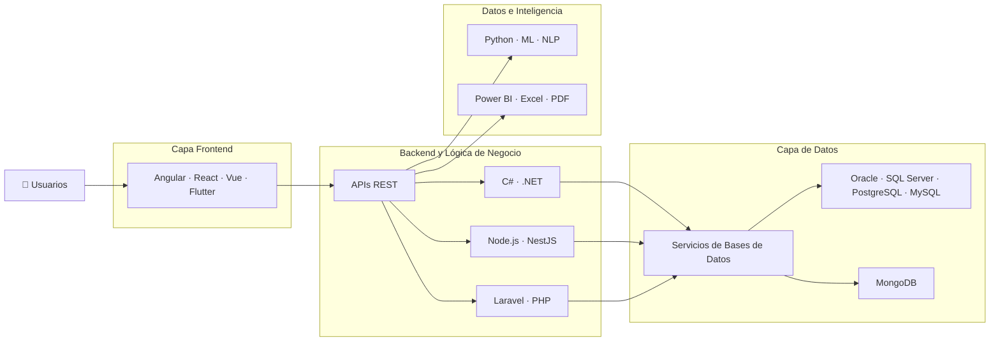
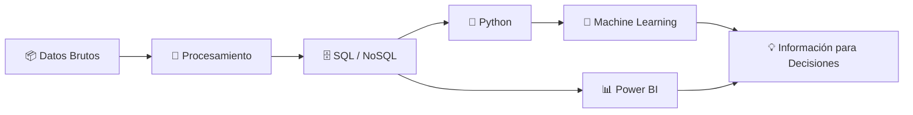

<!--
╔══════════════════════════════════════════════════════════════╗
║                  MAURICIO MORALES · GITHUB                  ║
║       Ingeniería de Software · Datos · IA · Backend         ║
╚══════════════════════════════════════════════════════════════╝


-->

<div align="center">

# 👋 Hola, soy Mauricio Morales

### Ingeniero de Sistemas · Desarrollador Full-Stack · Datos e IA · Backend y Microservicios


<a href="https://www.linkedin.com/in/mauricio-gonzalo-morales-fernandez-2506722b4/">
  
</a>

<a href="mailto:morales.12453447@gmail.com">
  
</a>

<a href="https://github.com/Miau44">
  
</a>


</div>

---


## 👨‍💻 Sobre mí

Soy **Ingeniero de Sistemas de La Paz, Bolivia**, enfocado en el desarrollo de soluciones de software robustas, escalables y orientadas a resolver problemas reales.

Mi perfil profesional combina **Desarrollo Full-Stack, Ingeniería Backend, Gestión de Bases de Datos, Análisis de Datos e Inteligencia Artificial**.

He trabajado en plataformas empresariales e institucionales relacionadas con:

- 🏗️ Sistemas de información empresariales
- ⚙️ Arquitectura Backend y lógica de negocio
- 🌐 Aplicaciones web Full-Stack
- 🤖 Chatbots y automatización con Inteligencia Artificial
- 📊 Dashboards y Business Intelligence
- 🗄️ Bases de datos relacionales y NoSQL
- 🧠 Machine Learning y análisis predictivo
- 🔐 Roles, permisos, auditoría y trazabilidad
- 📑 Generación automática de reportes PDF y Excel
- 💳 Análisis financiero y evaluación de riesgo crediticio
- 🔌 Diseño e integración de APIs REST
- ☁️ Cloud y fundamentos de CI/CD

<br clear="right"/>

---

## 🚀 ¿Qué desarrollo?

<table>
<tr>

<td width="50%" valign="top">

### 🏢 Software Empresarial

Desarrollo sistemas orientados a procesos operativos reales, reglas de negocio, automatización y gestión de información.

**Tecnologías:**

`C#` · `.NET` · `Angular` · `NestJS` · `Laravel` · `Vue`

</td>

<td width="50%" valign="top">

### 💳 Tecnología Financiera

Desarrollo de aplicaciones para **análisis financiero, evaluación de riesgo crediticio, dashboards y apoyo a la toma de decisiones**.

**Tecnologías:**

`Machine Learning` · `SQL` · `Python` · `Power BI` · `Excel`

</td>

</tr>

<tr>

<td width="50%" valign="top">

### 🤖 IA y Automatización

Desarrollo de chatbots, asistentes inteligentes, soluciones orientadas a procesamiento de lenguaje natural y automatización de procesos.

**Tecnologías:**

`Node.js` · `Python` · `REST APIs` · `NLP` · `Machine Learning`

</td>

<td width="50%" valign="top">

### 📊 Datos y Business Intelligence

Transformación de información operacional en dashboards, reportes, indicadores e información útil para la toma de decisiones.

**Tecnologías:**

`Power BI` · `SQL` · `Pandas` · `NumPy` · `Excel` · `R`

</td>

</tr>
</table>

---

# 💼 Experiencia destacada en Ingeniería de Software

## 💳 Plataforma de Análisis Financiero y Riesgo Crediticio

> Plataforma financiera Full-Stack desarrollada como proyecto de grado.

Diseñé y desarrollé una plataforma web para una entidad financiera con el objetivo de digitalizar procesos que anteriormente eran realizados mediante hojas de cálculo de Excel.

### Funcionalidades principales

- 📊 Dashboards de análisis financiero
- 💳 Evaluación de riesgo crediticio
- 🧠 Modelos de Machine Learning
- 📈 Estimación de solvencia
- ⚠️ Clasificación del nivel de riesgo
- 👥 Gestión de usuarios
- 🔐 Autenticación y autorización
- 📝 Auditoría de operaciones
- 📄 Generación automática de reportes PDF
- 📊 Exportación de información a Excel

### Stack tecnológico

`Laravel 11` `Vue 3` `Inertia.js` `MySQL` `Machine Learning`

---

## 🚡 Sistema de Gestión de Horarios Laborales

Desarrollé una plataforma interna para la gestión y planificación de horarios laborales en **Mi Teleférico**.

### Funcionalidades principales

- Configuración dinámica de jornadas laborales
- Gestión de turnos
- Asignación automática de sucursales
- Integración con Google Maps API
- Control de acceso basado en roles
- Módulo administrativo CRUD
- Registro de logs
- Auditoría de operaciones
- Trazabilidad del sistema

### Stack tecnológico

`C#` `.NET` `SQL` `Google Maps API`

---

## 🧠 Plataforma de Evaluación Psicológica

Desarrollé una plataforma web basada en el **Test de Kostick**, transformando reglas de evaluación psicológica en lógica de negocio dentro de una aplicación informática.

### Funcionalidades

- Gestión de cuestionarios
- Administración de usuarios
- Procesamiento de resultados
- Historial de evaluaciones
- Dashboards dinámicos
- Gráficos interactivos
- Exportación a Excel
- Generación automática de reportes PDF
- Control de accesos

### Stack tecnológico

`.NET` `SQL` `JavaScript` `Reporting`

---

## 🤖 AMI — Agente Municipal Inteligente

Participé en el desarrollo de un asistente institucional inteligente orientado a automatizar procesos de atención ciudadana.

### Capacidades

- Automatización mediante WhatsApp
- Gestión de preguntas frecuentes
- Navegación asistida de servicios municipales
- Derivación inteligente de solicitudes
- Escalamiento hacia agentes humanos
- Atención ciudadana centralizada

### Stack tecnológico

`Node.js` `Laravel` `REST APIs` `WhatsApp` `Telegram`

---

## 🏗️ SGEO+ — Sistema de Gestión de Obras Públicas

Participé en el desarrollo de un sistema de gestión de obras públicas compuesto por **15 módulos funcionales**.

Trabajé en:

- Análisis de requerimientos
- Diseño de bases de datos
- Desarrollo Backend
- Desarrollo Frontend
- Seguimiento de proyectos
- Control de avances
- Gestión documental
- Reportes administrativos

---

# 🧠 Arquitectura de Ingeniería



---

# 🛠️ Stack Tecnológico

## ⚙️ Backend

<p>


</p>

## 🎨 Frontend

<p>


</p>

## 📱 Desarrollo Móvil

<p>


</p>

---

# 🗄️ Bases de Datos

<p>


</p>

```sql
SELECT
    arquitectura_limpia,
    rendimiento,
    seguridad,
    escalabilidad,
    calidad_datos
FROM ingenieria
WHERE mentalidad = 'mejora_continua';
```

---

# 🤖 Inteligencia Artificial y Datos

<p>


</p>

### Flujo de trabajo con datos



---

# ☁️ Cloud, DevOps y Herramientas de Desarrollo

<p>


</p>

---

# 🧩 Mi Enfoque para Desarrollar Software

```text
Análisis de Requerimientos
        ↓
Reglas de Negocio
        ↓
Arquitectura del Sistema
        ↓
Diseño de Base de Datos
        ↓
Backend / APIs
        ↓
Experiencia Frontend
        ↓
Seguridad y Permisos
        ↓
Logs y Auditoría
        ↓
Datos y Reportes
        ↓
Pruebas
        ↓
Despliegue y Mejora Continua
```

Mi enfoque está orientado a construir software que no solo funcione, sino que también sea:

`Mantenible` · `Trazable` · `Seguro` · `Escalable` · `Orientado a Datos`

---

# 🎯 Áreas de Interés Profesional

<table>

<tr>
<td align="center">🏦<br><b>Sistemas Financieros</b></td>
<td align="center">⚙️<br><b>Ingeniería Backend</b></td>
<td align="center">🧠<br><b>IA y Automatización</b></td>
<td align="center">📊<br><b>Análisis de Datos</b></td>
</tr>

<tr>
<td align="center">🗄️<br><b>Ingeniería de Bases de Datos</b></td>
<td align="center">🔌<br><b>APIs REST</b></td>
<td align="center">🏗️<br><b>Sistemas Empresariales</b></td>
<td align="center">☁️<br><b>Cloud y CI/CD</b></td>
</tr>

</table>

---

# 🎓 Formación Académica

**Ingeniería en Sistemas Informáticos**  
Universidad del Valle · Bolivia  
`2021 — 2026`

**Diplomado en Educación Superior**  
Universidad del Valle · `2026`

**Diplomado en Desarrollo Web Full-Stack**  
Universidad del Valle · `2026 — Actualidad`

---

<details>

<summary><b>🏅 Certificaciones y Formación Especializada</b></summary>

<br>

| Área | Formación |
|---|---|
| 💳 Finanzas | Gestión de Riesgos Crediticios |
| 🗄️ Bases de Datos | Oracle Database Foundations |
| 🏗️ Diseño de BD | Oracle Database Design |
| 💻 SQL | Oracle Database Programming |
| 🧠 Inteligencia Artificial | Huawei HCIA Artificial Intelligence |
| 📊 Datos | Huawei Data Management and Analysis |
| 🤖 Machine Learning | Análisis Predictivo con Python y Machine Learning |
| 📈 Business Intelligence | Fundamentos de BI y Big Data |
| 📊 Visualización | Power BI |
| 🍃 NoSQL | MongoDB aplicado a Business Intelligence |
| 🤖 Automatización con IA | IA aplicada a atención al cliente y Call Center |

</details>

---

# 💻 Modo Desarrollador

```typescript
const mauricio = {
  profesion: "Ingeniero de Sistemas",
  ubicacion: "La Paz, Bolivia",

  especialidades: [
    "Desarrollo Full-Stack",
    "Ingeniería Backend",
    "Arquitectura de Bases de Datos",
    "Análisis de Datos",
    "Inteligencia Artificial",
    "Software Empresarial"
  ],

  backend: [
    "C#",
    ".NET",
    "NestJS",
    "Node.js",
    "Laravel",
    "Python"
  ],

  frontend: [
    "Angular",
    "React",
    "Vue",
    "TypeScript"
  ],

  basesDeDatos: [
    "Oracle",
    "SQL Server",
    "PostgreSQL",
    "MySQL",
    "MongoDB"
  ],

  intereses: [
    "Tecnología Financiera",
    "Machine Learning",
    "Microservicios",
    "Business Intelligence",
    "Automatización"
  ],

  misionActual:
    "Construir software confiable que transforme datos en mejores decisiones."
};
```

---

# 📊 Centro de Control de GitHub

<div align="center">

## 📈 Resumen del Perfil


</div>

---

<div align="center">

## 🔥 Racha de Desarrollo


</div>

---

<div align="center">

## ⚡ Actividad de Contribuciones


</div>

---

<div align="center">

## 🧠 Analítica de GitHub


</div>

---

<div align="center">

## 🏆 Logros en GitHub


</div>

---

# 🤝 Conectemos

<div align="center">

### Interesado en Ingeniería de Software, sistemas empresariales, tecnología financiera, Inteligencia Artificial y productos orientados a datos.

<a href="mailto:morales.12453447@gmail.com">
  
</a>

<a href="https://www.linkedin.com/in/mauricio-gonzalo-morales-fernandez-2506722b4/">
  
</a>

<a href="https://github.com/Miau44">
  
</a>

<br><br>

```text
> Construyendo software.
> Entendiendo los datos.
> Automatizando procesos.
> Resolviendo problemas reales.
```

**Gracias por visitar mi perfil 🚀**

</div>
